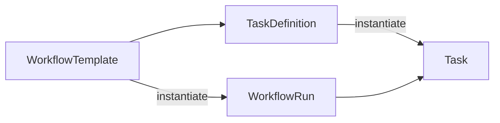

# Domain Model

## Purpose

The domain model describes core business and runtime entities as implemented today. It is independent of LLM providers and executor implementations.

---

# Core Principles

- **Project** is the central business aggregate for a research initiative.
- Workflow **definitions** are immutable; **runtime** objects are mutable.
- Tasks reference executors by **`executor_id`** only (see ADR-008).
- Domain layer does not import the application layer.

---

# Business Entities

## Project

Long-lived business context for one research initiative.

May include:

- `ProjectBrief` (client, business problem, research goal)
- References to workflow runs and artifacts (via application facade)

Exists independently of a single workflow execution.

---

## ResearchPlan (planning domain)

Aggregate produced after Planner LLM output is parsed and validated.

Contains **ResearchStage** and **PlannerTask** entities. Each planner task carries **`executor_id`** (canonical executor reference for mapping).

Mapped to **WorkflowTemplate** by the application layer; not executed directly.

---

# Workflow Definitions (immutable)

## WorkflowTemplate

Reusable workflow plan attached to a project context after planning.

Contains an ordered set of **TaskDefinition** objects and dependency metadata.

## TaskDefinition

Immutable blueprint for one unit of work.

| Field | Meaning |
|-------|---------|
| `id` | Stable task identifier within the template |
| `name` | Human-readable task name |
| `executor_id` | Registered executor identifier |
| `executor_type` | Executor category (`agent`, `tool`, `human`, `api`) |
| `depends_on` | Task IDs that must complete first |

**TaskDefinition** does not have runtime status.

---

# Workflow Runtime (mutable)

## WorkflowRun

Runtime instance created from a **WorkflowTemplate**.

Owns:

- `Task` instances
- `TaskDependencyGraph`
- `WorkflowRun.status` (owned exclusively by **WorkflowEngine**)

Uses a domain state machine; direct status mutation is blocked.

## Task

Runtime instance created from a **TaskDefinition**.

| Field | Meaning |
|-------|---------|
| `definition_id` | Link back to template task id |
| `executor_id` | Same semantic as in **TaskDefinition** |
| `executor_type` | Same semantic as in **TaskDefinition** |
| `status` | Task lifecycle (`CREATED` → `READY` → `RUNNING` → terminal) |
| `depends_on` | Resolved dependency task ids |

**Task** is what **TaskScheduler** and **TaskExecutor** operate on.

---

# Definition vs Runtime



| | Definition | Runtime |
|---|------------|---------|
| Workflow | **WorkflowTemplate** | **WorkflowRun** |
| Task | **TaskDefinition** | **Task** |
| Mutability | Immutable plan | Status and lifecycle change during execution |
| Created by | Planner mapping | **WorkflowRunFactory** |

---

# Supporting Domain Concepts

## TaskDependencyGraph

Directed acyclic graph of task dependencies attached to **WorkflowRun**. Built at factory time; validated for cycles.

## WorkflowStatus / TaskStatus

Value objects enforced by state machines in `domain/runtime/state_machine.py`.

## Knowledge, Document, Artifact

Conceptual business outputs. Static knowledge files live under `knowledge/`. Full artifact/document persistence is not the focus of the current runtime loop documentation.

---

# Entity Relationships

```
Project
  └── planning produces WorkflowTemplate
        └── TaskDefinition (executor_id, depends_on)
              └── WorkflowRunFactory creates WorkflowRun
                    └── Task (runtime, executor_id, status)
                          └── TaskDependencyGraph
```

---

# Design Rules

- Domain entities never call LLMs.
- Runtime objects do not embed business rules for executor resolution.
- **`executor_id`** is the only runtime executor identifier (ADR-008).
- **WorkflowEngine** mutates **WorkflowRun** status; schedulers and executors do not.

---

# Related Documents

- [overview.md](overview.md) — runtime flow
- [layers.md](layers.md) — layer boundaries
- [ADR-008: Executor Catalog Contract](../docs/adr/ADR-008-Executor-Catalog-Contract.md)
