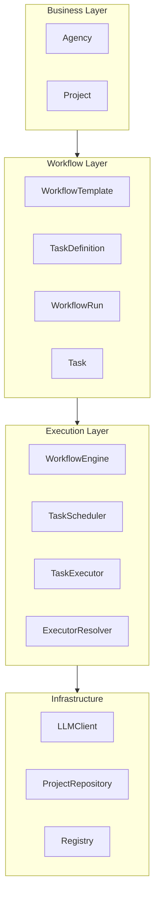

# Architecture Layers

## Purpose

This document defines the architectural layers of AI Research OS, their responsibilities, and interaction rules as implemented in the current codebase.

---

# Layered Model



---

# 1. Business Layer

## Purpose

Represents the business domain and application facade.

## Components (implemented)

| Component | Location | Role |
|-----------|----------|------|
| **Agency** | `agency/agency.py` | Application facade: projects, planning, workflow start |
| **Project** | `domain/project.py` | Central business aggregate for a research initiative |
| **ProjectBrief** | `domain/project_brief.py` | Client context fed to the Planner |
| **Knowledge** | `knowledge/` | Static expertise files (not runtime state) |

## Responsibilities

- Persist and expose business context
- Own project lifecycle at the facade level
- Remain independent of LLM and executor implementations

## Must not

- Execute workflow tasks directly
- Resolve executors
- Own runtime scheduling logic

---

# 2. Workflow Layer

## Purpose

Separates immutable workflow definitions from mutable runtime execution.

## Definition (immutable)

| Entity | Role |
|--------|------|
| **WorkflowTemplate** | Reusable workflow plan produced by the Planner |
| **TaskDefinition** | Single task blueprint: `id`, `name`, `executor_id`, `depends_on` |

## Runtime (mutable)

| Entity | Role |
|--------|------|
| **WorkflowRun** | Instance of a template; owns `Task` collection and dependency graph |
| **Task** | Runtime task instance with status, `executor_id`, `executor_type` |

## Planning bridge

| Component | Role |
|-----------|------|
| **ResearchPlan** | Domain planning aggregate from parsed LLM output |
| **ResearchPlanWorkflowTemplateMapper** | Maps plan → `WorkflowTemplate` |
| **WorkflowRunFactory** | Instantiates `WorkflowRun` and `Task` from template |

## Must not

- Call LLMs directly (planning is delegated to PlannerAgent)
- Execute tasks (delegated to Execution Layer)

---

# 3. Execution Layer

## Purpose

Synchronous workflow orchestration and task execution.

## Components (implemented)

| Component | Location | Role |
|-----------|----------|------|
| **WorkflowEngine** | `application/workflow_engine.py` | Owns runtime loop and `WorkflowRun.status` |
| **TaskScheduler** | `application/task_scheduler.py` | Readiness, dependency graph scheduling |
| **TaskExecutor** | `application/task_executor.py` | Invokes executor for one task |
| **ExecutorResolver** | `application/executor_resolver.py` | Maps `executor_id` → registered executor |
| **TaskLifecycleManager** | `application/task_lifecycle_manager.py` | Task execution lifecycle transitions |
| **WorkflowCompletionPolicy** | `application/runtime/workflow_completion_policy.py` | Computes terminal workflow status |

## Runtime loop (one iteration)

1. `TaskScheduler.schedule()` — update readiness from dependency graph
2. `TaskScheduler.find_ready_task()` — select one ready task
3. `TaskExecutor.execute()` — run executor if a ready task exists
4. `WorkflowCompletionPolicy` — stop when terminal or no progress

## Must not

- Store business aggregates unrelated to execution
- Invent executor IDs
- Perform fuzzy executor matching or fallback resolution

---

# 4. Infrastructure Layer

## Purpose

External services and technical adapters.

## Components (implemented)

| Component | Role |
|-----------|------|
| **OpenAIClient** | LLM adapter (`infrastructure/llm/`) |
| **ProjectRepository** | Project persistence |
| **AgentLoader / Registry** | Registers agent executors by `executor_id` |
| **StructuredOutputParser** | Strict JSON extraction and contract validation |
| **StructuredOutputGenerator** | LLM retry orchestration for planner output |
| **Persistence adapters** | `FileProjectRepository`, in-memory adapters, `PostgreSQL*` adapters (`infrastructure/persistence/`) |

Application persistence services (`application/services/`) sit above repository ports. `Agency` delegates project persistence to `ProjectService`; external entry points must not call repositories directly.

Composition root: `application/composition_root.py`.

---

# Layer Interaction Rules

Allowed dependency direction:

```
Business Layer
      ↓
Workflow Layer
      ↓
Execution Layer
      ↓
Infrastructure Layer
```

The Execution Layer reads and updates runtime objects (`WorkflowRun`, `Task`) through defined application services. It does not replace `Project` as the business aggregate.

---

# Forbidden Dependencies

- Business entities → LLM client
- **TaskScheduler** → task execution
- **PlannerAgent** → executor registry (uses **ExecutorCatalog** instead)
- **WorkflowTemplate** → **WorkflowRun** (templates do not reference runs)
- **TaskDefinition** → **Task** (definitions do not reference runtime instances)
- Free-form agent names (`suggested_agent`) in runtime contracts

---

# Related Documents

- [overview.md](overview.md)
- [domain-model.md](domain-model.md)
- [ADR-008: Executor Catalog Contract](../docs/adr/ADR-008-Executor-Catalog-Contract.md)
