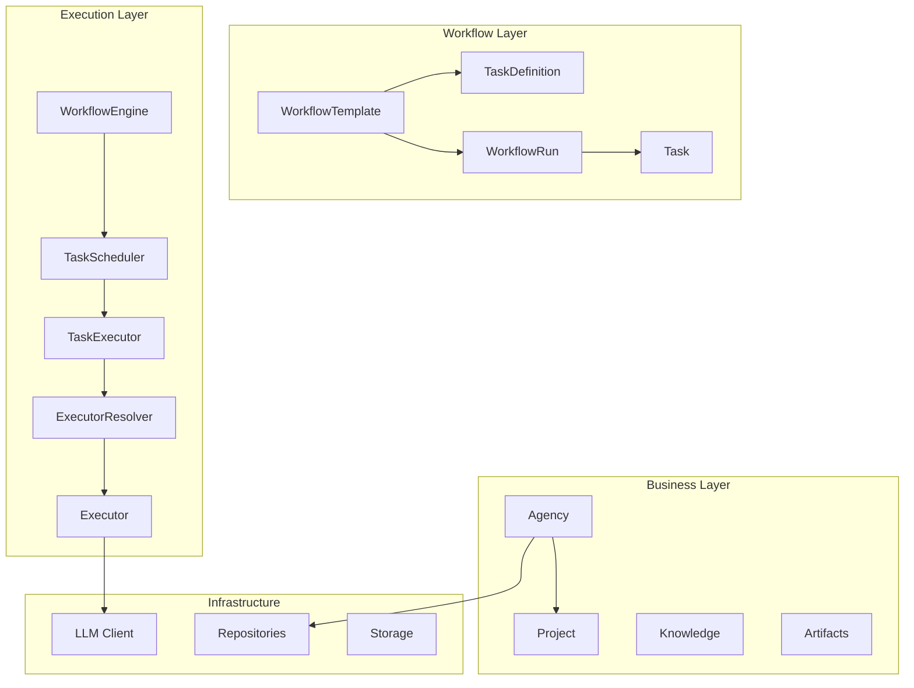
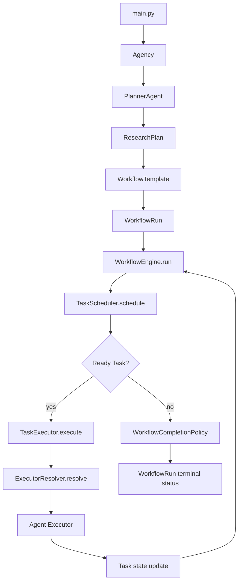
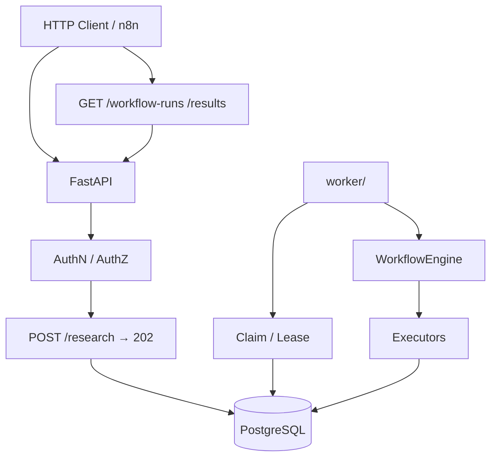

# Architecture Overview

## Purpose

AI Research OS is an AI-native operating system for professional marketing research agencies.

The platform manages research projects by combining business workflows, structured knowledge, reusable process definitions, and synchronous task execution. AI agents are execution components inside a defined architecture — not the architecture itself.

---

# Architectural Statement

> AI Research OS is an operating system for marketing research. AI agents execute tasks within workflows; business entities and runtime contracts own the truth.

---

# High-Level Layers

| Layer | Responsibility | Key types |
|-------|----------------|-----------|
| Business | Long-lived business context | `Agency`, `Project`, `Knowledge`, artifacts |
| Workflow | Immutable plans and runtime runs | `WorkflowTemplate`, `TaskDefinition`, `WorkflowRun`, `Task` |
| Execution | Orchestration and task execution | `WorkflowEngine`, `TaskScheduler`, `TaskExecutor`, `ExecutorResolver` |
| Infrastructure | OpenAI LLM client, repository adapters, API key crypto |

---

# End-to-End Runtime Flow

### In-process demo path (`main.py`, embedded memory)

This is the synchronous path used by `main.py` and the offline demo.

### Production HTTP + worker path (PostgreSQL)

1. **FastAPI** authenticates the caller and authorizes project access.
2. **Research submission** persists a durable run and returns **202**; idempotency is scoped per project + key.
3. **Worker** claims the run, executes via **WorkflowEngine**, checkpoints to PostgreSQL.
4. Client polls run status, results, logs, and artifact metadata over HTTP.

---

# Executor Contract

Planner output and runtime execution share a single identifier: **`executor_id`**.

- The Planner receives an **ExecutorCatalog** (allowed IDs and descriptions) in its prompt.
- **PlannerPayloadContract** rejects unknown or empty `executor_id` values before `WorkflowRun` creation.
- Invalid planner output triggers **StructuredOutputGenerator** correction retry (strict parser unchanged).
- **ExecutorResolver** is the only component that resolves `executor_id` to an executor instance at runtime.

See [ADR-008: Executor Catalog Contract](../docs/adr/ADR-008-Executor-Catalog-Contract.md) for the full decision record. Do not invent executor IDs at planning time.

Registered agent executor IDs (current): `planner`, `search`, `analysis`, `report`, `proposal`.

---

# Definition vs Runtime

| Concept | Role | Mutability |
|---------|------|------------|
| **WorkflowTemplate** | Immutable workflow plan | Defined at planning time |
| **TaskDefinition** | Immutable task blueprint inside a template | Contains `executor_id`, dependencies |
| **WorkflowRun** | Runtime workflow instance | Status tracked by state machine |
| **Task** | Runtime task instance | Status, lifecycle, executor reference |

**TaskDefinition** describes what should run. **Task** is what actually runs inside a **WorkflowRun**.

---

# Core Design Principles

- Business before AI.
- **Project** is the central business aggregate during a research initiative.
- Process definitions are separated from runtime execution.
- **WorkflowEngine** is the sole owner of `WorkflowRun.status`.
- **TaskScheduler** schedules; **TaskExecutor** executes; never combined.
- One ready task per runtime loop iteration (synchronous, deterministic).
- Major decisions are recorded in ADRs under `docs/adr/`.

---

# Related Documentation

- [domain-model.md](domain-model.md) — entities and relationships
- [layers.md](layers.md) — layer boundaries and forbidden dependencies
- [docs/adr/README.md](../docs/adr/README.md) — Architecture Decision Records
- [docs/architecture.md](../docs/architecture.md) — documentation index

---

# Evolution

Significant architectural changes follow: discussion → ADR → implementation → review.

Accepted ADRs are immutable; supersede with a new ADR instead of editing history.
