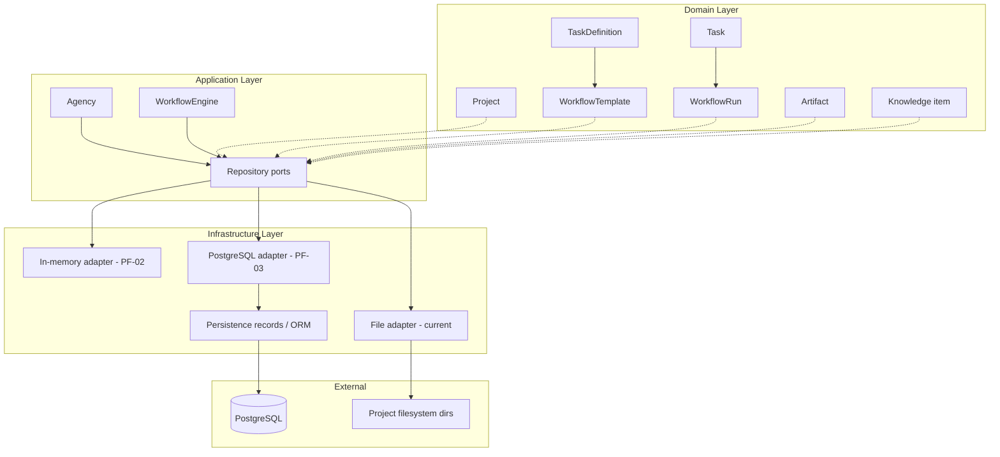

# Product Foundation — Persistence Architecture

This document defines the persistence contract for Product Foundation (PF-01). It does **not** introduce PostgreSQL, ORM models, migrations, or API code. Runtime behavior remains unchanged until PF-02+.

**Authoritative decision record:** [ADR-009: Persistence Boundary and Repository Strategy](../docs/adr/ADR-009-Persistence-Boundary-and-Repository-Strategy.md)

---

## Persistence context



**Current state:** Only `Project` metadata is partially persisted via `infrastructure/project_repository.py` (JSON + directory scaffold). All workflow runtime objects are in-memory for the duration of `Agency.start_research()`.

---

## Aggregate ownership

| Object | Definition / runtime | Aggregate root | Durable | Mutable | Storage ownership | Repository access |
|--------|---------------------|----------------|---------|---------|-------------------|-------------------|
| Agency configuration | Application config | No | Env/config only | N/A | Environment / `ApplicationConfig` | Not a repository |
| **Project** | Business | **Yes** | Yes | Mutable | Project record + directory scaffold | `ProjectRepository` |
| **WorkflowTemplate** | Definition | **Yes** | Yes | Immutable snapshot | Template store | `WorkflowTemplateRepository` |
| **TaskDefinition** | Definition | No (child of template) | Yes (embedded in template) | Immutable | With template | Via template repository |
| **WorkflowRun** | Runtime | **Yes** | Yes | Mutable (state machine) | Run store | `WorkflowRunRepository` |
| **Task** | Runtime | No (child of run) | Yes | Mutable (state machine) | With run | Via run repository only |
| **TaskDependencyGraph** | Runtime | No (child of run) | Yes | Rebuilt at create; edges immutable | With run | Via run repository only |
| **Task result** | Runtime output | No | Yes | Replace per task completion | With run or log | Run save or log append |
| **Execution log** | Runtime audit | No (scoped to run/task) | Yes | Append-only | Log store | `ExecutionLogRepository` |
| **Artifact** | Business output | **Yes** | Yes | Mutable until published | Artifact store + blob ref | `ArtifactRepository` |
| **Knowledge item** | Business reference | **Yes** | Yes | Mutable | Knowledge store / files | `KnowledgeRepository` |
| **WorkflowContext** | Execution session | No | **No** | Transient | Not persisted as blob | Decomposed into run/results/logs |
| **Executor** | Infrastructure | No | No | Registry wiring | Code registry | Not persisted |

---

## Repository contract

| Repository | Aggregate managed | Required operations | Query boundaries | Transaction boundary | Partial updates | Optimistic concurrency | Child persistence |
|------------|--------------------|--------------------|------------------|---------------------|-----------------|------------------------|-------------------|
| **ProjectRepository** | `Project` | `create`, `save`, `get_by_id`, `list`, `delete` | By id; list with filters | Per project save | Full aggregate replace | `version` / `updated_at` on save | N/A |
| **WorkflowTemplateRepository** | `WorkflowTemplate` (+ definitions) | `save_snapshot`, `get_by_id`, `list_for_project` | By template id; by project | Per template snapshot | No — immutable snapshot | Optional content hash dedup | TaskDefinitions embedded |
| **WorkflowRunRepository** | `WorkflowRun` (+ tasks, graph) | `create`, `get_by_id`, `save`, `list_for_project` | By run id; by project + status | Per run lifecycle transition | No — aggregate save | Required on `save` | Tasks and graph via root |
| **ArtifactRepository** | `Artifact` | `save`, `get_by_id`, `list_for_project`, `list_for_run` | By project/run/type | Metadata + linkage | Metadata fields only after create | On metadata update | Optional run/project FK |
| **KnowledgeRepository** | Knowledge item | `save`, `get_by_id`, `list_for_project`, `delete` | By project scope | Per item | Allowed for content/metadata | On update | N/A |
| **ExecutionLogStore** | Log entry | `append`, `list_for_run`, `list_for_task` | Time-ordered by run/task | Per append | N/A (append-only) | N/A | Scoped to run/task |

### Port semantics (PF-02)

**ProjectRepository**

| Operation | Responsibility |
|-----------|----------------|
| `create(project)` | Persist a **new** aggregate only. Rejects existing IDs (`DuplicateEntityError`). Initializes version to 0 and fully persists the supported representation. Does not construct business objects — `ProjectFactory` creates aggregates. |
| `save(project)` | Persist modifications to an **existing** aggregate. Rejects missing aggregates (`EntityNotFoundError`). Supports optimistic concurrency via `expected_version`. |
| `delete(project_id, expected_version=...)` | Remove an existing aggregate. Verifies existence and optional version before delete. |

**WorkflowRunRepository**

| Operation | Responsibility |
|-----------|----------------|
| `create(workflow_run, project_id=...)` | Persist a **pre-built** aggregate only. `WorkflowRunFactory` assembles tasks and graph in the application layer. Repository does not construct domain state. |
| `save(workflow_run)` | Persist lifecycle transitions to an existing run. |

**Repositories never construct business objects.**

### WorkflowRun project ownership

A `WorkflowRun` belongs to exactly one `Project`. The domain model does not yet expose `project_id` on `WorkflowRun` (deferred to avoid domain changes in PF-02). Durable persistence requires `project_id` as part of run identity and indexing — tracked in adapter storage today, to be formalized in PF-03 (PostgreSQL schema + mapper).

### File adapter status

`FileProjectRepository` is a **transitional adapter** preserving the legacy JSON-on-disk layout. It does **not** support complete `Project` aggregate round-trip (nested optional fields are not restored). The PostgreSQL adapter (PF-03) will implement the full persistence model with dedicated mappers.

### Contract tests vs adapter tests

| Suite | Location | Purpose |
|-------|----------|---------|
| **Repository contract tests** | `tests/application/ports/` | Verify port semantics shared by all compliant adapters: aggregate create/save boundaries, optimistic concurrency, duplicate detection, round-trip, append-only log semantics |
| **Adapter-specific tests** | e.g. `tests/infrastructure/persistence/` | Verify implementation-specific behavior (transitional file layout, partial round-trip limits). Not part of the generic port contract. |

### Application services (PF-02.5)

External entry points (API, CLI, workers, n8n) must call **application services**, not repository ports directly.

```
Agency / API / CLI / Worker
        ↓
Application Services  (application/services/)
        ↓
Repository Ports
        ↓
Persistence Adapters
```

| Service | Coordinates | Factory role |
|---------|-------------|--------------|
| `ProjectService` | Project CRUD use cases | `ProjectFactory` constructs aggregates |
| `WorkflowService` | Template snapshots and run persistence | `WorkflowRunFactory` constructs runs |
| `ArtifactService` | Artifact metadata (`ArtifactRecord`) | None — caller supplies record |
| `KnowledgeService` | Knowledge items (`KnowledgeItem`) | None — caller supplies record |

**Agency** is a high-level facade: project creation delegates to `ProjectService`; runtime execution (`start_research`) still uses `WorkflowRunFactory` in-memory until PF-03 wiring.

**ExecutionLogService:** Not introduced in PF-02.5. `ExecutionLogStore` remains a port for direct injection at the composition root when worker/API layers need append semantics. A dedicated service will be added when event assembly orchestration is required (PF-06).

**Unit of Work:** Not implemented. Each service method performs one repository transaction. Cross-repository atomic orchestration is deferred until a concrete use case requires it (PF-03 PostgreSQL transactions).

**Exception policy:** Services propagate `DuplicateEntityError`, `EntityNotFoundError`, and `ConcurrentModificationError` unchanged. Transport-layer translation belongs to PF-05 (FastAPI).

---

## Transaction scenarios

### 1. Create WorkflowRun and Tasks

```
BEGIN
  INSERT workflow_run (id, project_id, template_id, status=CREATED, version=1)
  INSERT tasks[] from template
  INSERT dependency_edges[] from graph
COMMIT
```

**Atomic.** Duplicate `run_id` → reject (idempotent create only if same payload hash — otherwise conflict).

### 2. Claim / start Task

```
BEGIN
  SELECT workflow_run FOR UPDATE (or version check)
  domain: task.transition(RUNNING)
  UPDATE run + tasks + version
COMMIT
```

**Atomic.** Retry safe if task already `RUNNING` with same worker attempt id.

### 3. Complete Task

```
BEGIN
  load run aggregate
  domain: complete task + store result summary
  append execution log (optional same txn or follow-up)
  save run
COMMIT
```

**Atomic** for run state + result summary. Log append may share transaction or follow immediately after.

### 4. Fail Task

Same pattern as complete; terminal status `FAILED` or policy-driven workflow failure.

### 5. Finalize WorkflowRun

```
BEGIN
  load run
  domain: WorkflowCompletionPolicy → terminal workflow status
  save run
COMMIT
```

**Atomic.** No-op if already terminal with equivalent outcome.

### 6. Persist execution logs

```
BEGIN
  INSERT execution_log (event_id, run_id, task_id, payload, ts)
COMMIT
```

**Atomic per event.** Duplicate `event_id` ignored (idempotent append).

### 7. Persist artifacts

```
BEGIN
  INSERT artifact metadata
  LINK to project_id / run_id
COMMIT
-- blob upload may precede or follow; metadata txn after blob success
```

**Metadata transaction atomic;** blob storage eventual.

### 8. Recover interrupted workflow

```
load WorkflowRun at last committed version
TaskScheduler reads task statuses from aggregate
reclaim policy for stale RUNNING (PF-06)
```

**Not a single transaction** — recovery is read + scheduler decision. No automatic re-run without explicit policy.

---

## Domain / ORM separation

```
┌─────────────────────────────────────┐
│ Domain models (dataclasses, enums,  │
│ state machines) — no infra imports   │
└─────────────────┬───────────────────┘
                  │ used by
┌─────────────────▼───────────────────┐
│ Repository ports (application)       │
└─────────────────┬───────────────────┘
                  │ implemented by
┌─────────────────▼───────────────────┐
│ Adapters + mappers (infrastructure)  │
└─────────────────┬───────────────────┘
                  │ uses
┌─────────────────▼───────────────────┐
│ ORM records / SQL (infrastructure)   │
└─────────────────────────────────────┘

FastAPI schemas ── separate ──► map to/from domain at API boundary
```

**Do not** make domain models SQLAlchemy models. **Do not** expose ORM records to `WorkflowEngine`.

---

## Current implementation findings

| Area | Finding |
|------|---------|
| Repository abstractions | Ports in `application/ports/`; `FileProjectRepository` + in-memory adapters |
| File persistence | `FileProjectRepository` — transitional adapter; partial aggregate round-trip only |
| Unimplemented runtime wiring | Workflow/template/run repositories not yet wired into `Agency` execution path |
| Dependency direction | `Agency` and `ApplicationOverrides` depend on `ProjectRepository` port |
| Domain purity | Domain layer does not import infrastructure (verified) |
| ID generation | `uuid4()` for projects, tasks, and workflow runs when id not supplied |
| Serialization risk | Populating `Project.runs` would break JSON round-trip (`TaskDependencyGraph`, enums) |
| Execution log | `ExecutionLogEntry` + `ExecutionLogStore` port (append-only) |
| Artifacts | Domain stub; `WorkflowRun.artifacts` returns empty list |

---

## Docker-readiness constraints

| Constraint | Requirement |
|------------|-------------|
| Configuration | `DATABASE_URL`, credentials, paths via environment variables |
| Portability | No hard-coded DB host, credentials, or Windows-specific paths |
| Local + container | Same config contract in both environments |
| Testability | PostgreSQL replaceable with in-memory / test container adapters |
| Migrations | Explicit migrate step; no silent DDL on import or prod startup |
| Compose scope | Development orchestration only; not imported by domain or application |
| File paths | Use configurable roots; POSIX-friendly defaults inside containers |

---

## Implementation sequence

| Phase | Scope | Depends on |
|-------|-------|------------|
| **PF-01** | Persistence contract (this doc + ADR-009) | Phase B runtime |
| **PF-02** | Repository ports + in-memory adapters + contract tests | PF-01 — **complete** |
| **PF-02.5** | Application persistence services | PF-02 — **complete** |
| **PF-03** | PostgreSQL adapter + Alembic migrations + mappers | PF-02.5 |
| **PF-04** | Docker Compose dev environment | PF-03 |
| **PF-05** | FastAPI application boundary | PF-02 (ports), PF-03 (optional for full stack) |
| **PF-06** | Background workflow execution + reclaim policy | PF-03, PF-05 |

PF-05 may begin against in-memory adapters before PF-03 completes; full stack integration requires PF-03.

---

## Related documents

- [architecture/overview.md](overview.md)
- [architecture/domain-model.md](domain-model.md)
- [architecture/layers.md](layers.md)
- [docs/backlog.md](../docs/backlog.md)
