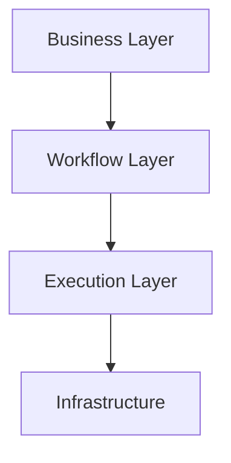

# AI Research OS — Architecture Documentation

This page indexes architecture documentation that matches the **current production code**. For narrative detail, start with [architecture/overview.md](../architecture/overview.md).

---

# Layer Model

| Layer | Components |
|-------|------------|
| Business | `Agency`, `Project`, `ProjectBrief`, knowledge files |
| Workflow | `WorkflowTemplate`, `TaskDefinition`, `WorkflowRun`, `Task` |
| Execution | `WorkflowEngine`, `TaskScheduler`, `TaskExecutor`, `ExecutorResolver` |
| Infrastructure | `OpenAIClient`, `ProjectRepository`, agent registry |

---

# Runtime Entry Point

| Step | Component | Module |
|------|-----------|--------|
| 1 | Application bootstrap | `main.py` → `application/composition_root.py` |
| 2 | Research start | `agency/agency.py` |
| 3 | Planning | `agents/planner/` + `application/planner/` |
| 4 | Template mapping | `ResearchPlanWorkflowTemplateMapper` |
| 5 | Run creation | `WorkflowRunFactory` |
| 6 | Execution loop | `application/workflow_engine.py` |
| 7 | Scheduling | `application/task_scheduler.py` |
| 8 | Task execution | `application/task_executor.py` |
| 9 | Executor resolution | `application/executor_resolver.py` |

---

# Task and Workflow Models

### Definition (immutable)

- **WorkflowTemplate** — workflow plan attached to a project after planning
- **TaskDefinition** — single task blueprint with `executor_id` and `depends_on`

### Runtime (mutable)

- **WorkflowRun** — instance of a template; owns tasks and dependency graph
- **Task** — runtime instance with status; scheduled and executed by the engine

---

# Executor Contract

Planner and runtime share **`executor_id`**.

- **ExecutorCatalog** — allowed IDs injected into planner prompts
- **PlannerPayloadContract** — semantic validation before run creation
- **ExecutorResolver** — sole runtime mapping from `executor_id` to executor instance

See [ADR-008: Executor Catalog Contract](adr/ADR-008-Executor-Catalog-Contract.md). Other documents should reference ADR-008 rather than duplicating the full contract.

---

# Architecture Documents

| Document | Content |
|----------|---------|
| [architecture/overview.md](../architecture/overview.md) | Layers, runtime flow, principles |
| [architecture/layers.md](../architecture/layers.md) | Layer responsibilities and forbidden dependencies |
| [architecture/domain-model.md](../architecture/domain-model.md) | Entities, TaskDefinition vs Task |
| [architecture/product-foundation-persistence.md](../architecture/product-foundation-persistence.md) | PF-01 persistence contract, repository ports, transactions |
| [ARCHITECTURE.md](../ARCHITECTURE.md) | Short entry point |
| [adr/README.md](adr/README.md) | ADR index |
| [adr/ADR-009-Persistence-Boundary-and-Repository-Strategy.md](adr/ADR-009-Persistence-Boundary-and-Repository-Strategy.md) | Persistence ADR |

---

# Out of Scope

The following are **not** documented here because they are not part of the current implemented runtime:

- ExecutorDefinition registry type (beyond catalog IDs)
- StartResearch, Product Foundation, Search Pipeline
- Knowledge Graph, Execution Graph
- Future integrations (n8n, web UI)

Document only what exists in production code today.
